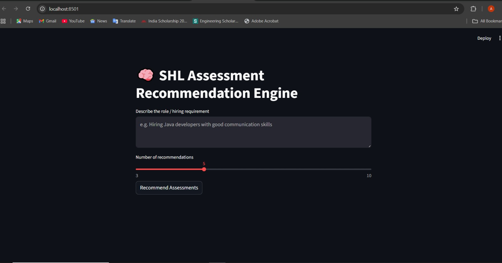
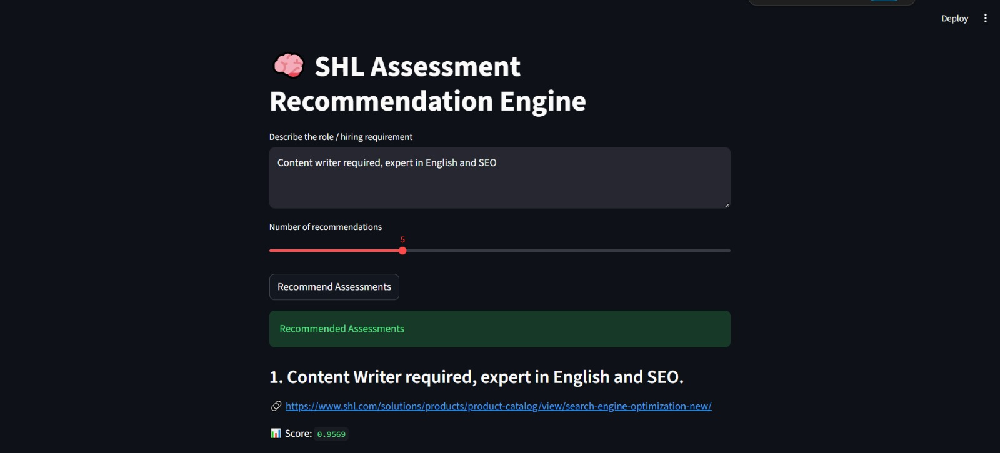
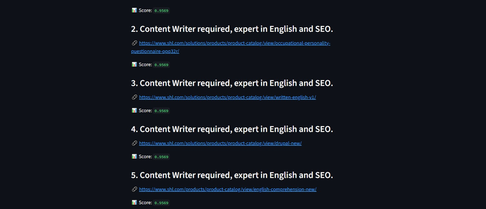
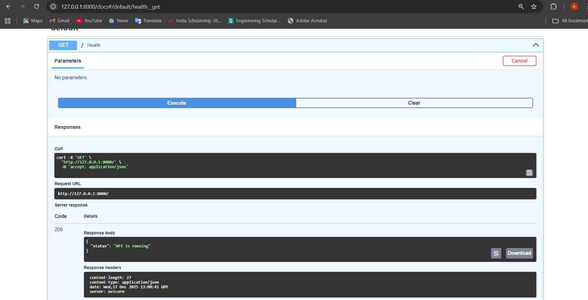
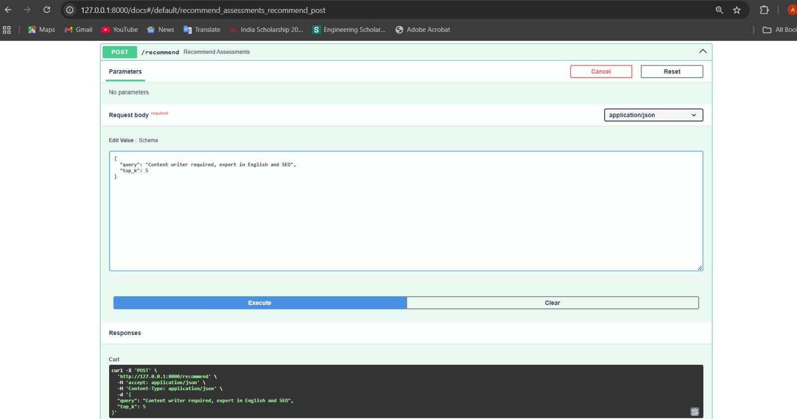
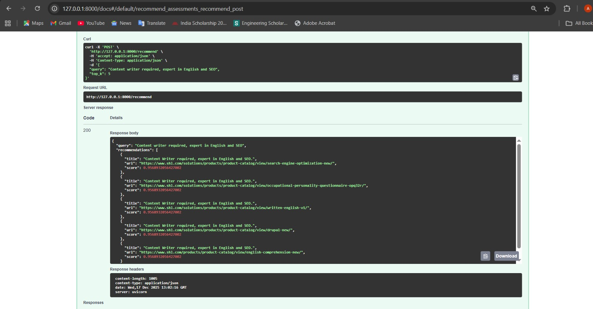

# 🧠 SHL Assessment Recommendation Engine

An end-to-end semantic recommendation system that suggests relevant SHL assessments
based on natural language hiring requirements.

The system leverages sentence embeddings and vector similarity search to match
job descriptions with suitable SHL assessments in a scalable and interpretable way.

---

## 🚀 Features

- Semantic search using sentence embeddings (MiniLM)
- Efficient similarity search using FAISS
- RESTful API built with FastAPI
- Interactive Streamlit web interface
- Human-readable recommendations (title + URL)
- Health check endpoint for API monitoring

---

## 🏗️ System Architecture

The recommendation system follows a clear, modular pipeline:

1. **User Query Input**  
   Hiring requirements are provided in natural language (e.g., role description).

2. **Sentence Embedding (MiniLM)**  
   The query is converted into a dense semantic vector using a pretrained
   sentence transformer model.

3. **FAISS Vector Search**  
   The query embedding is compared against precomputed assessment embeddings
   using cosine similarity.

4. **Top-K Retrieval**  
   The most semantically relevant SHL assessments are selected and ranked.

5. **FastAPI Response Layer**  
   Results are returned as a structured JSON response with titles, URLs, and
   relevance scores.

6. **Streamlit User Interface**  
   Recommendations are displayed in a clean, interactive web interface.

---

## 🔧 Technical Approach

### Text Representation
Each SHL assessment is represented using its **title** (instead of only URLs) to
improve semantic understanding and recommendation quality.

Embeddings are generated using:

sentence-transformers/all-MiniLM-L6-v2

---

### Vector Search
- FAISS is used for fast similarity search over embedding vectors
- Lower cosine distance indicates higher relevance
- Results are sorted by relevance score for better interpretability

---

### Recommendation Logic
1. User provides a natural language hiring requirement
2. Query is converted into an embedding
3. FAISS searches for nearest assessment embeddings
4. Top-K most relevant assessments are returned

---

## 📁 Project Structure

```text
shl-assessment-recommendation/
│
├── api/
│   └── app.py                # FastAPI backend (recommendation API)
│
├── data/
│   ├── raw/
│   │   └── shl_catalog_raw.csv    # Original SHL assessment catalog
│   ├── processed/                 # Cleaned / transformed data
│   └── evaluation/
│       └── Gen_AI_Dataset.xlsx    # Validation dataset
│
├── embeddings/
│   ├── build_embeddings.py    # Embedding generation script
│   ├── shl_faiss.index        # FAISS vector index
│   └── shl_metadata.pkl       # Assessment metadata
│
├── frontend/
│   └── app.py                # Streamlit web UI
│
├── scraping/
│   ├── convert_excel_to_catalog.py  # Dataset conversion utility
│   └── scrape_shl_catalog.py         # (Optional) scraper
│
├── requirements.txt          # Python dependencies
└── README.md                 # Project documentation


## 🚀 How to Run the Project
1️⃣ Install Dependencies
pip install -r requirements.txt

2️⃣ Build Embeddings
python embeddings/build_embeddings.py

3️⃣ Start the API
python -m uvicorn api.app:app --reload


API Docs: http://127.0.0.1:8000/docs

Health Check: http://127.0.0.1:8000/

4️⃣ Launch Frontend
python -m streamlit run frontend/app.py


UI: http://localhost:8501

## 📸 Application Screenshots

### Streamlit User Interface – Input


### Streamlit User Interface – Recommendations



### API Health Check


### FastAPI Swagger Documentation



##🔌 API Example

Endpoint: POST /recommend

Request Body:

{
  "query": "Hiring Java developers with strong communication skills",
  "top_k": 5
}


Response:

{
  "query": "...",
  "recommendations": [
    {
      "title": "Core Java – Advanced Level",
      "url": "https://www.shl.com/...",
      "score": 0.42
    }
  ]
}

##🧪 Validation & Testing

The recommendation system was validated using multiple realistic hiring scenarios
(e.g., software engineering, content writing, sales, and administrative roles).

A dedicated script (evaluation/test_queries.py) was used to verify:

Semantic relevance of recommendations

Ranking behavior across different domains

API stability and response consistency

Manual testing was also performed via:

Swagger UI (/docs)

Streamlit frontend with varied queries and recommendation sizes

##📊 Evaluation Methodology (Planned)

The recommended evaluation metric for this task is Mean Recall@K, using the provided labeled training dataset.

Due to time constraints, a full Recall@K computation pipeline was not finalized.
However, the system is designed to support this evaluation by:

Separating catalog data from queries

Supporting batch evaluation

Returning ranked recommendations suitable for Recall@K analysis

##⚠️ Known Limitations & Assumptions

The current catalog is a subset of SHL assessments used to validate correctness and architecture.

Full-scale crawling (377+ assessments) is supported by the pipeline but was limited for this implementation.

Recommendation balancing across multiple assessment categories is handled implicitly via semantic similarity rather than explicit rule-based weighting.

These trade-offs were made to prioritize robust system design, clarity, and correctness.

##✅ Key Strengths

Clean, modular architecture

Strong use of semantic embeddings (not keyword matching)

Scalable FAISS-based retrieval

Fully working API + frontend

Clear separation of concerns

Transparent assumptions and limitations

##🔮 Future Improvements

Full SHL catalog ingestion (377+ assessments)

Automated Recall@K evaluation

Explicit balancing across assessment types

Caching and performance optimization

Deployment using Docker / cloud services

##📌 Conclusion

This project demonstrates a production-ready foundation for an AI-driven assessment recommendation system.
The focus was on sound engineering principles, explainability, and extensibility, with clear paths for further enhancement.
